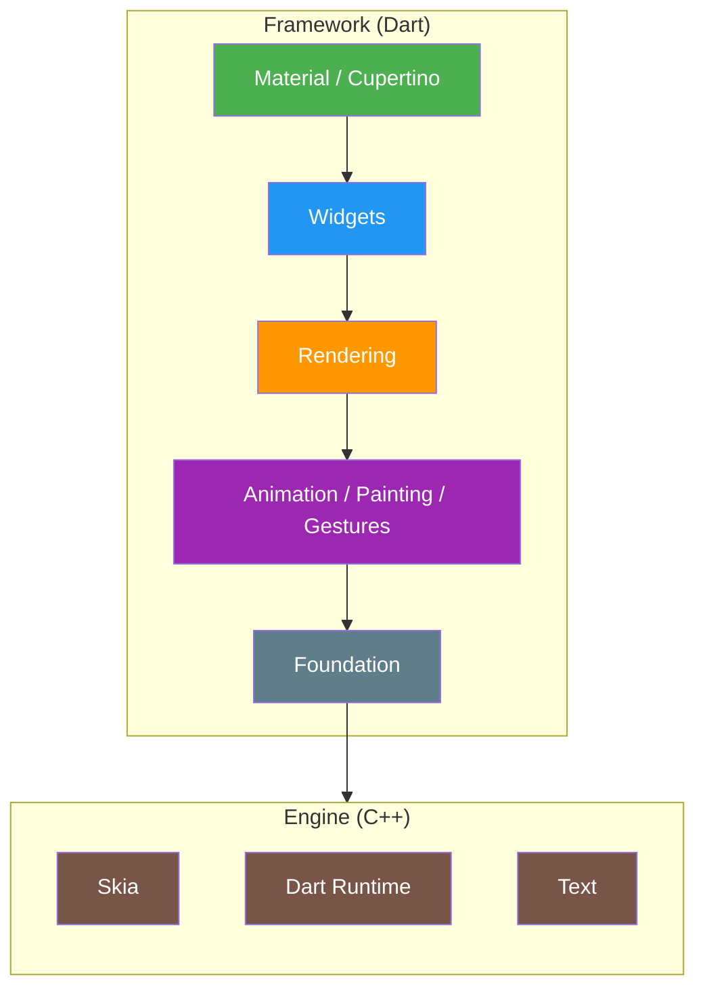
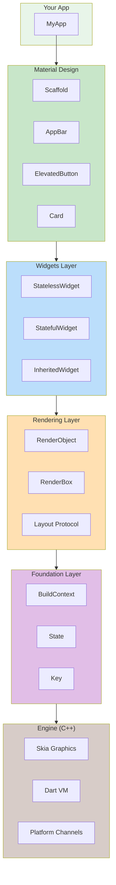

# Flutter 架构图

## 层级说明

| 层级 | 组件 | 说明 |
|------|------|------|
| **Framework (Dart)** | | |
| 顶层 | Material, Cupertino | UI 设计规范组件 |
| 组件层 | Widgets | 可组合的 UI 构建块 |
| 渲染层 | Rendering | 布局和绘制 |
| 基础层 | Animation, Painting, Gestures | 动画、绑定、手势 |
| 底层 | Foundation | 基础工具类和服务 |
| **Engine (C++)** | Skia, Dart, Text | 底层渲染引擎 |

## 详细架构图

